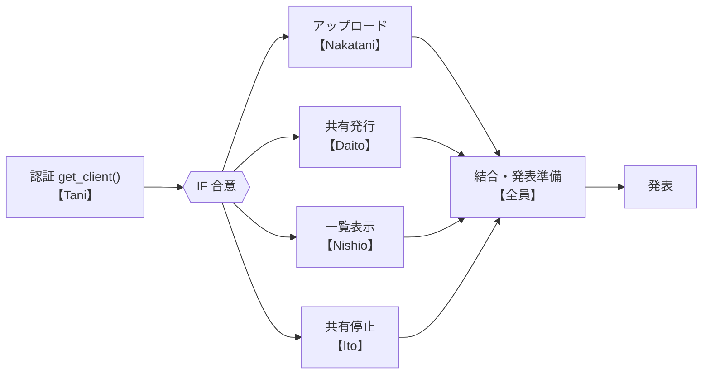

# 開発スケジュール

`share` CLI の作業分解（WBS）と進行スケジュール。

## 前提

- 2 回目演習は **環境構築**で消化済み。
- 残りの授業：**開発演習(3) → 講演 → 発表**。

## 担当割り当て

| 機能 | 担当 |
|------|------|
| 認証・main 管理 | Tani |
| ローカルファイルのアップロード | Nakatani |
| 共有リンクの発行 | Daito |
| 共有中ファイルの一覧表示 | Nishio |
| 共有の停止 / 削除 | Ito |

## 回ごとの進行

| 回 | 位置づけ | やること |
|----|----------|----------|
| 2 回目（済） | 環境構築 | uv sync / リポジトリ整備 |
| 〜 (3) まで（授業外） | **実装の本体** | Tani が認証＋IF を最優先で確定 → 共有。4 人は IF に沿って各自の機能を並行実装し、結合直前まで進める |
| 開発演習(3) | **唯一の同期コマ** | 各自の成果を持ち寄り、結合テスト・API 疎通・詰まり解消・発表準備 |
| 講演 | バッファ（開発枠なし） | 上村さん講演。未完分は授業外で仕上げ|
| 発表 | 成果発表 | 説明 |

## WBS（作業分解）

```
share CLI 開発
├─ 1. 土台整備【Tani】最優先（IF 合意まで）
│   ├─ 1.1 Dropbox認証 
│   ├─ 1.2 サブコマンド登録パターン
│   └─ 1.3 インターフェース合意・共有
├─ 2. アップロード【Nakatani】
│   ├─ 2.1 files_upload 実装
│   └─ 2.2 テスト（mock）
├─ 3. 共有リンク発行【Daito】
│   ├─ 3.1 create_shared_link 実装
│   └─ 3.2 テスト（mock）
├─ 4. 一覧表示【Nishio】
│   ├─ 4.1 list_shared_links 実装
│   └─ 4.2 テスト（mock）
├─ 5. 共有停止【Ito】
│   ├─ 5.1 revoke_shared_link 実装
│   └─ 5.2 テスト（mock）
└─ 6. 結合・仕上げ【全員】
    ├─ 6.1 結合テスト
    ├─ 6.2 発表準備（スライド・デモ）
    └─ 6.3 README/PR整備
```

## 依存関係


